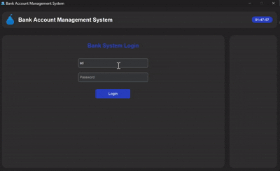

# 🏦 BankApp GUI - Main Application

A sleek, multi-threaded banking system interface built with **CustomTkinter**, featuring secure login, dynamic data tables, threaded operations, and interactive dialogs. Perfect for managing accounts and employees! 🚀

---

## 🌟 Highlights

- **🔐 Secure Login**: Threaded authentication prevents UI freeze and displays progress status.
- **⏰ Real-Time Clock**: Updates every second in both login and main interfaces.
- **📊 Dynamic Tables**: Scrollable, selectable tables for customers and employees with alternating row colors.
- **📂 Modular Frames**: Clean separation of login, main content, and menu panels.
- **🎨 Theming**: Adopts colors and appearance from `Config` settings.
- **📜 Audit Logs**: Actions tracked via `LogManager` for traceability.
- **🧵 Thread Management**: Graceful shutdown waits on active threads.

---

## 🚀 Quick Start

1. **Add Assets**:
   ```bash
   BankApp/
   ├── logo.png
   ├── account.png
   └── menu_icon.png
   ```
2. **Run**:
   ```bash
   python main.py
   ```
   - Login with default admin: `admin` / `admin`.

---

## 📋 UI Structure

1. **Upper Frame**: Logo, app title, and live clock.  
2. **Login UI**: Username & password fields, login button, clock update.  
3. **Main UI**:  
   - **Menu Panel**: Buttons for CRUD operations and logout.  
   - **Content Panel**: Search bar, accounts table, dynamic dialogs.

---

## 📽️ Videos of system
1. **Log in proccess**
This GIF showcases the steps involved in logging into the banking application.

• **Login Page**: The GIF starts with the login page, which includes input fields for the username and password.\
• **Entering Information**: The user enters their username and password.\
• **Login Button**: After entering the information, the user clicks on the "Login" button.\
• **Login Confirmation**: Finally, the GIF shows that the user's information is verified, and they are redirected to the main page of the application. This section may include a simple animation indicating a successful login.



2. **Performing Operations on Accounts**
This GIF illustrates various operations that users can perform on their bank accounts.

• **Selecting an Account**: The GIF begins with a display of a list of user accounts, from which the user selects one.\
• **Different Operations**: The user can then choose one of the following operations:\
– **Withdraw Funds**: The user enters the desired amount to withdraw and clicks on the "Withdraw" button. The GIF shows that the account balance is updated.\
– **Deposit Funds**: Similarly, the user enters the desired amount to deposit and clicks on the "Deposit" button.\
– **Change Account Status**: The user can change the account status from "Active" to "Inactive" and vice versa. The GIF displays this status change.\
– **Edit User Account**: In this section, the user can edit their account information (such as name, phone number, etc.) and then clicks on the "Save" button.

.gif)

3. **Adding and Deleting Accounts**
This GIF focuses on the process of adding and deleting bank accounts.

• **Account Management Page**: The GIF starts by displaying a page showing the list of existing accounts.\
• **Adding an Account**: The user clicks on the "Add Account" button. A form for adding a new account opens, and the user enters the necessary information (such as account holder's name, account number, etc.). After filling out the form, the user clicks on the "Save" button, and the GIF shows that the new account has been added to the list.\
• **Deleting an Account**: In the next step, the user selects one of the accounts and clicks on the "Delete" button. The GIF displays a confirmation message for deletion, and after user confirmation, the account is removed from the list.
.gif)


## 🖥️ Key Components

### Threaded Login
```python
login_thread = threading.Thread(target=self._perform_login, args=(username, password), daemon=True)
```
- Disables the login button, shows "Processing...", and re-enables after.

### Dynamic Table Creation
```python
for row_index, row_values in enumerate(rows):
    row_frame = CTkFrame(...)
    row_frame.pack(...)
```
- Alternating backgrounds, click-to-select, and table headers.

### Interactive Dialogs
- **Create/Edit Account**: `CTkToplevel` forms with validation.  
- **Withdraw/Deposit**: Amount entry with error checks.  
- **User Info**: Conditional admin tools (add/delete user, show employee list).

### Graceful Exit
```python
def on_close(self):
    self._wait_for_threads()
    self.destroy()
```
- Waits up to 2 seconds for threads to finish, logging warnings if not.

---

## 🔧 Configuration & Logging

- **Config**: Titles, window size, theming from `Config`.  
- **Logging**: All actions logged via `LogManager`.

---

## 🌱 Future Enhancements

- 🔄 **Real-time Updates**: WebSocket or polling for live data sync.  
- 📈 **Analytics Dashboard**: Charts for account stats.  
- 🖥️ **Responsive Layout**: Adapt to window resizing.  
- 🌐 **Web Integration**: Flask API back-end.

---

Built with ❤️ by **Arshia Saberian**. Feedback welcome! ✉️

